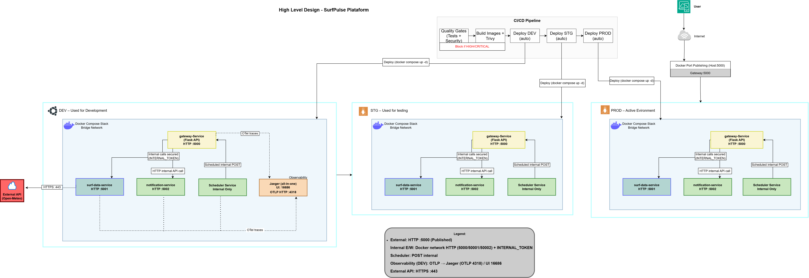

# Projeto Final DevOps Engineer

**Alisson Melo**

**Repositório GitHub:** https://github.com/Melo2L/projeto-final-devops (Público)

------------------------------------------------------------------------

## Introdução

Este projeto consiste no desenvolvimento da plataforma **SurfPulse**, uma aplicação web baseada em microserviços Python, integrada a uma arquitetura DevOps completa.

A aplicação foi containerizada com Docker e automatizada através de um pipeline CI/CD com GitHub Actions, permitindo:

- Build automatizado
- Testes automatizados
- Análise de segurança (DevSecOps)
- Scan de imagens
- Deploy progressivo entre ambientes

Além da funcionalidade da aplicação, o foco principal foi demonstrar a implementação prática de:

- Microserviços
- Docker Compose
- CI/CD
- DevSecOps
- Observabilidade
- Gestão de ambientes (DEV, STG, PRD)

------------------------------------------------------------------------

## Objetivo da Aplicação

Esta aplicação tem como objetivo fornecer previsões meteorológicas
relevantes para atividades relacionadas com o surf, como vento, ondas e
temperatura, através da integração com uma API externa.

Os utilizadores podem consultar estas informações para apoiar decisões
operacionais ou desportivas. Paralelamente, o projeto demonstra a
implementação prática de um ambiente DevOps completo com microserviços,
CI/CD automatizado e monitorização.

------------------------------------------------------------------------

## HLD -- High Level Design

  

O meu HLD apresenta a arquitetura geral da plataforma SurfPulse baseada em microsserviços conteinerizados, evidenciando a separação entre gateway, serviços internos de dados, notificações e agendamento. O acesso do utilizador ocorre através de um ponto de entrada público (Load Balancer), que encaminha requisições para o gateway-service, responsável pela orquestração das chamadas internas e integração com a API externa Open-Meteo. 

Fluxo Geral:

User  
→ Internet  
→ Docker Port Publishing (:5000)  
→ gateway-service  
→ Serviços internos  
→ API externa (Open-Meteo)

O ponto de entrada da aplicação é o **gateway-service**, exposto através do Docker Port Publishing na porta 5000.

O gateway orquestra chamadas internas para:

- surf-data-service
- notification-service
- scheduler-service

A API externa Open-Meteo é consumida exclusivamente pelo surf-data-service via HTTPS.

A observabilidade com Jaeger está ativa apenas no ambiente DEV.

O pipeline CI/CD automatiza a promoção da aplicação entre ambientes.

Ambientes:

## DEV
- Ambiente de desenvolvimento
- Observabilidade ativa com Jaeger
- ENABLE_OTEL=true
- Utilizado para debugging e tracing

## STG
- Ambiente de validação intermédia
- Estruturalmente igual ao PRD
- Sem Jaeger
- ENABLE_OTEL=false

## PRD
- Ambiente final
- Execução automática do scheduler
- Sem observabilidade ativa
- Ambiente estável para entrega de valor

------------------------------------------------------------------------

## Arquitetura

A aplicação segue uma arquitetura baseada em microserviços
containerizados utilizando Docker.

O gateway atua como ponto central de acesso às APIs, encaminhando os
pedidos para os serviços internos.

O serviço de dados integra uma API meteorológica externa para recolha de
informações relevantes sobre vento, ondas e temperatura. O serviço de
notificações processa relatórios automatizados destinados aos
utilizadores finais.

A observabilidade é assegurada através do Jaeger com OpenTelemetry.

Ambientes:

-   DEV -- desenvolvimento e testes\
-   STG -- validação intermédia\
-   PRD -- produção

------------------------------------------------------------------------

## Pipeline CI/CD

Pipeline implementado com GitHub Actions.

Etapas:

1. Quality Gate
- pytest
- Bandit (SAST)
- pip-audit

Bloqueia pipeline se HIGH/CRITICAL.

2. Build Images
- Build das imagens Docker
- Tag com APP_TAG

3. Scan de Segurança
- Trivy para análise das imagens

4. Deploy Automático
- Deploy DEV
- Deploy STG
- Deploy PRD

Deploy realizado com:

docker compose up -d

A atualização ocorre através de pull da nova imagem e recriação dos containers.

------------------------------------------------------------------------

## Como Usar a Aplicação

Execução Local (DEV)

Clone o repositório:

git clone https://github.com/Melo2L/projeto-final-devops
cd projeto-final-devops

Execute:

docker compose up -d --build

A aplicação ficará disponível em:

http://localhost:5000
------------------------------------------------------------------------
## Endpoint Principal

Exemplo:

curl http://localhost:5000/report

Fluxo executado:

1. gateway recebe requisição
2. surf-data-service consulta Open-Meteo
3. dados retornam ao gateway
4. notification-service gera relatório
5. resposta enviada ao utilizador

------------------------------------------------------------------------

## Execução Automática (PRD)

No ambiente PRD, o scheduler-service executa chamadas internas periódicas:

scheduler → gateway → notification-service

Gerando relatórios automáticos.

------------------------------------------------------------------------

## Testes

Testes automatizados executados na pipeline:

- Unit tests
- Smoke tests
- Security checks

Garantem estabilidade antes da promoção entre ambientes.

------------------------------------------------------------------------

## DevSecOps

A segurança foi integrada diretamente ao pipeline.

Ferramentas utilizadas:

- Bandit (SAST)
- pip-audit (dependências)
- Trivy (scan de imagens Docker)

Práticas implementadas:

- Comunicação interna protegida com INTERNAL_TOKEN
- Separação lógica de serviços
- Validação contínua no CI/CD
- Bloqueio para vulnerabilidades HIGH/CRITICAL

Prints dos testes na pasta Prints.

------------------------------------------------------------------------

## Monitoramento

A observabilidade com Jaeger e OpenTelemetry está ativa apenas no ambiente DEV.

Permite:

- Tracing distribuído
- Identificação de gargalos
- Debugging de chamadas internas

Interface padrão:

http://localhost:16686

------------------------------------------------------------------------

## Erros e Ajustes Durante o Projeto

Ocorreram desafios relacionados com Docker, CI/CD e integração de
serviços. Foram resolvidos através de ajustes na pipeline, Dockerfiles e
compose files.

Deixei prints dos erros e ajustes no arquivo README.pdf.
------------------------------------------------------------------------

## Limpeza e Destruição da Infraestrutura

Comandos utilizados:

docker compose down\
docker compose down -v\
docker system prune -af

------------------------------------------------------------------------

## Conclusão

O projeto demonstra a implementação prática de:

- Microserviços Python
- Docker Compose
- CI/CD automatizado
- DevSecOps
- Gestão de ambientes
- Observabilidade (DEV)

A arquitetura permite evolução futura e escalabilidade horizontal.

------------------------------------------------------------------------

## Fontes

-   Docker Docs\
-   GitHub Actions Docs\
-   OpenTelemetry Docs\
-   Jaeger Docs\
-   StackOverflow\
-   ChatGPT
    Deepseek
    Reddit